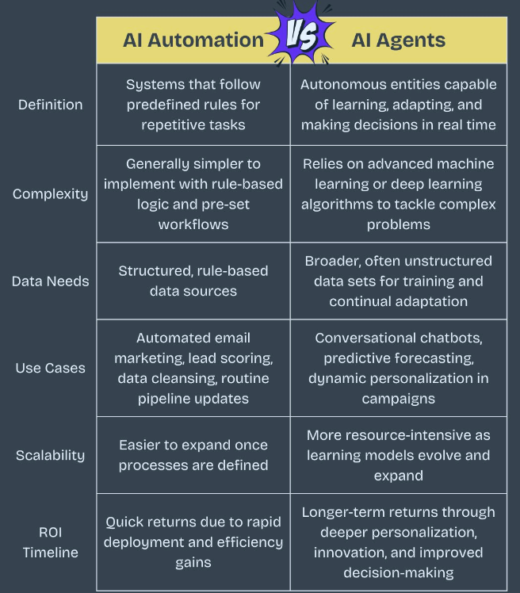
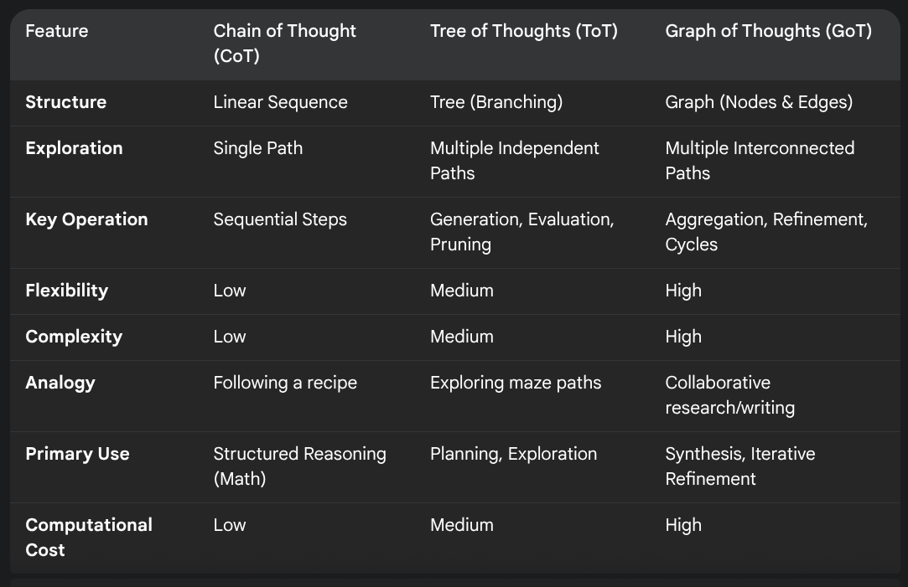

* scribbled notes
** learning order
- learn sql before orm
- learn git before jenkins
- learn math before ai/ml
- learn sql before nosql
- learn css before tailwind
- learn linux before docker
- learn solidity before dapps
- learn english before python
- learn rest before graphql
- learn javascript before react
- learn html before javascript
- learn javascript before typescript
- learn react before microfrontends
- learn containers before kubernetes
- learn neural networks before llms
- learn monolith before microservices
- learn data structures before leetcode
- learn networking before cloud services
- learn monolith before modular monolith
- learn to draw flowcharts before writing code
- learn business requirements before writing code  
** sre roadmap
- start → linux → networking → os → scripting → git → cloud → containers → kubernetes → ci/cd
- service mindset → availability → latency → capacity → performance → reliability → risk → automation
- host → process → cpu → memory → disk → filesystem → dns → tcp → http → tls
- deploy → observe → detect → triage → mitigate → recover → review → automate
- logs → metrics → tracing → dashboards → alerts → on-call → runbooks → escalation
- slis → slos → slas → error budgets → paging → incident response → postmortems
- manual work → scripts → iac → pipelines → safer releases → self-healing where it makes sense
- monolith → services → distributed systems → multi-az → multi-region only when needed
- postgres → redis → kafka → object storage → search → backups → disaster recovery
- symptom → signal → bottleneck → root cause → fix → follow-up → prevention
- functional requirements → non-functional requirements → capacity estimation → failure modes → recovery plan → scale plan
- cpu spike → memory leak → disk full → dns issue → tls expiry → node failure → region outage
- think → measure → simplify → automate → communicate → stay calm
- consistency → clarity → repetition → deep work
- end → crack sre interviews and run real production systems
** postgresql database types and equivalent
1) Relational,"Core PostgreSQL (Native tables with SQL, foreign keys, and schemas)
2) Key-Value,"HSTORE extension or a table with (key TEXT PRIMARY KEY, value TEXT)
3) Columnar,Citus extension (Columnar storage) or Hydra
4) Wide-Column,JSONB indexing or partitions combined with flexible schemas
5) Document,JSONB (Binary JSON) with GIN indexing for nested querying
6) Vector,pgvector extension (Stores and queries vector embeddings)
7) Time-Series,TimescaleDB extension or native Declarative Partitioning
8) Immutable Ledger,immudb extension or Trigger-based audit logs with append-only permissions
9) Graph,Apache AGE extension or Recursive CTEs (WITH RECURSIVE)
10) Geospatial,PostGIS extension (The industry standard for spatial data)
11) In-Memory,UNLOGGED tables or RAMDisk storage via Tablespaces
12) Blob,BYTEA data type or Large Object (lo) storage
13) Text-Search,TSVector and TSQuery (Native Full-Text Search) with GIN/GIST indexes
** backend exercises 
- feature flag system - interfaces, rules engine, extensibility
- retry + backoff library - strategy pattern, pluggable policies
- notification routing system - channels, priorities, templates
- rate limiter - algorithms, abstractions, thread safety
- circuit breaker - states, transitions, failure thresholds
- metrics aggregator - time windows, aggregation logic, concurrency
- configuration manager - versioning, caching, listeners
- payment processing flow - state machines, idempotency, validations
- cache library - eviction policies, extensible storage
- job scheduler - workers, queues, retries, priorities
** cache
10 caching concepts you must learn for backend:  
- cache aside (lazy loading) 
- write through 
- write behind (async) 
- cache invalidation 
- ttl & explicit eviction (lru/lfu) 
- cache stampede (meltdown) 
- distributed cache consistency 
- hot keys (skew handling) 
- cache warming (preload strategy) 
- multi-layer caching (l1/l2/cdn)
** leetcode problems - data structure and algorithms
- sliding window: 3, 76, 209, 424, 567, 904
- two pointers: 11, 15, 16, 18, 42, 167
- fast/slow pointers (linked list): 141, 142, 19, 876, 160, 234
- binary search on sorted data: 33, 34, 35, 153, 162, 704
- binary search on answer: 875, 1011, 410, 774, 1283, 1482
- hashing / frequency maps: 1, 49, 128, 217, 242, 347
- prefix sum / running sum: 303, 560, 724, 930, 974, 523
- difference array / range updates: 370, 1094, 1109, 1893, 1943, 2381
- monotonic stack: 739, 496, 503, 84, 85, 901
- monotonic queue / deque: 239, 862, 1425, 1438, 1499, 1696
- heap / top k: 215, 347, 692, 703, 973, 1046
- intervals: 56, 57, 252, 253, 435, 452
- greedy scheduling / sorting: 45, 55, 406, 621, 763, 134
- linked list manipulation: 21, 23, 24, 25, 92, 138
- tree dfs: 104, 112, 113, 543, 124, 226
- tree bfs / level order: 102, 103, 199, 515, 637, 116
- bst problems: 98, 99, 230, 235, 450, 700
- backtracking basics: 46, 47, 77, 78, 90, 39
- backtracking with constraints: 40, 17, 79, 131, 51, 52
- graph bfs / dfs: 200, 695, 733, 994, 1091, 1254
- topological sort / dag: 207, 210, 802, 1462, 1203, 2115
- union find / dsu: 547, 684, 1319, 1579, 990, 1202
- shortest path: 743, 787, 1514, 1631, 1334, 1976
- mst / graph greedy: 1584, 1135, 1168, 1489, 778, 1102
- trie: 208, 211, 212, 648, 677, 1268
- bit manipulation: 136, 137, 191, 338, 268, 190
- 1d dp basics: 70, 198, 213, 322, 279, 300
- knapsack / subset dp: 416, 494, 518, 474, 1049, 879
- grid dp: 62, 63, 64, 221, 931, 120
- string dp / sequence dp: 1143, 72, 115, 583, 97, 1312
** high performers
high performers do not manage time. they manage boundaries.
*** the meeting rejector
situation: someone sends an agenda-less invite blocking your core working hours.
response: i need to protect my deep work blocks today. could you send over a brief memo instead? if we still need to sync after, let us schedule 15 minutes tomorrow.
why it works: defaulting to yes for meetings destroys momentum. forcing a memo makes the organizer actually think through what they need. 90 percent of the time, the memo solves the problem and the meeting never happens.
*** the default to async
situation: a quick question interrupts your flow state on slack.
response: i am heads down on a critical sprint until 2 pm. i will review this and drop my thoughts in the thread before the end of the day.
why it works: asking for a minute never takes a minute. it takes 20 minutes to regain your focus. training your team that you are not immediately available forces them to problem-solve independently first.
*** the delegation pivot
situation: a task lands on your desk that a junior dev can do 80 percent as well.
response: i am going to hand this over to the junior team. they have the right context and it will be a great stretch project. i will review the final draft.
why it works: perfectionism is a bottleneck. if someone else can do it mostly right, let them. your job is to review and guide, not to execute every single ticket. this builds their skills and frees your time.
*** the scope pushback
situation: a stakeholder demands an unreasonable deadline for a massive feature.
response: we can hit that date, but we need to descale the feature set by 30 percent. let me know which of these three requirements is the lowest priority.
why it works: you cannot bend time, but you can bend scope. never accept a fixed deadline with a fixed scope if it means burning out your team. put the trade-off decision back on the stakeholder.
*** the status update killer
situation: a 30-minute weekly alignment meeting that could easily be an email.
response: since this meeting is mostly status updates, let us move it to a shared document. everyone updates their section by friday noon. we only meet if there are active blockers.
why it works: reading is faster than speaking. reclaiming 30 minutes for 6 people saves 3 hours of company time every single week. reserve synchronous time strictly for solving complex problems.
*** the focus shield
situation: slack messages piling up and context switching is killing your code quality.
response: set status to: in deep work until 1 pm. call my cell if the servers are literally on fire.
why it works: visual boundaries matter. when people see you are actively blocking out time, they hesitate before interrupting. treat your deep work blocks with the same respect as a meeting with the ceo.
*** the scope creep defender
situation: a product manager asks: can we just add this one small thing?
response: that is a great idea. let us add it to the backlog for the next sprint so we do not derail our current deliverables.
why it works: one small thing is never small. it introduces bugs, delays testing, and breaks momentum. acknowledging the idea while strictly deferring it keeps the current sprint pristine.
*** the brain dump
situation: too many open loops at 5 pm causing evening anxiety.
response: spend 10 minutes writing every pending task down. close the laptop. the brain knows the list is safe and stops processing it.
why it works: people remember uncompleted tasks better than completed ones. writing them down offloads the cognitive burden, allowing you to actually rest and recover without thinking about work at dinner.
*** the energy audit
situation: doing low-impact admin work during your peak mental hours.
response: shift all low-leverage tasks to the 3 pm slump. reserve 9 am to 11 am strictly for architecture, coding, and high-level strategy.
why it works: not all hours are created equal. two hours of focused energy in the morning can outproduce six hours of fatigued work in the afternoon. map your tasks to your biological energy levels.
*** the single tab rule
situation: 40 tabs open, constantly switching contexts, zero focus.
response: close everything except the exact tool needed for the current task. friction prevents distraction.
why it works: every open tab is a subtle cognitive drain. it is a constant reminder of something else you should be doing. by isolating your workspace, you force your brain to engage with the single problem in front of you.
*** the weekend boundary
situation: just checking email on a saturday morning.
response: delete work apps from your personal phone. if it is an absolute emergency, they will call you.
why it works: your brain needs uninterrupted recovery time to perform at a high level on monday. casual checking keeps you in a state of low-grade stress all weekend. sever the connection completely.
*** the 80/20 shipper
situation: polishing a feature for another week instead of launching.
response: ship it when it solves the core problem. the final 20 percent of polish usually takes 80 percent of the time and delivers minimal value to the user.
why it works: perfectionism is disguised procrastination. get the product into the hands of users. their feedback is infinitely more valuable than your internal assumptions about what needs polishing.
*** the meeting cost calculator
situation: inviting 8 engineers to a 1-hour call just to keep them in the loop.
response: this meeting costs the company $1000 in engineering hours. let us cut the invite list to the 3 decision makers and record it for the rest.
why it works: when you frame meetings in terms of actual dollar costs and lost engineering hours, unnecessary invites disappear. only invite people whose active input is required to move forward.
*** the morning buffer
situation: opening email or slack before even getting out of bed.
response: no inputs for the first hour of the day. use that time to dictate your own priorities before reacting to everyone else.
why it works: starting your day in your inbox puts you in a reactive state. you are instantly working on other people agendas. claim the first hour to set your own baseline and strategic goals for the day.
*** the context switch batching
situation: answering emails and messages the exact second they arrive.
response: turn off all notifications. check your inbox exactly twice a day: 11 am and 4 pm. process to zero, then close the tab.
why it works: context switching is the silent killer of productivity. batching your communication allows you to process information efficiently without breaking your deep work cycles multiple times an hour.
*** the documentation habit
situation: explaining the same deployment process for the third time this month.
response: record a quick video while doing it once. add it to the company wiki. next time someone asks, just send the link.
why it works: you should never solve the same problem twice. build a personal library of documentation. it scales your knowledge and radically reduces the time you spend answering repetitive questions.
*** the let it burn principle
situation: minor, non-critical bugs surfacing during a major feature launch.
response: not every fire needs your water. if it does not impact revenue or security, let it sit in the backlog until bug-fix day.
why it works: high performers are comfortable letting small things break so they can focus on the massive levers. if you chase every minor issue, you will never have the bandwidth to build the things that actually matter.
*** the friday shutdown
situation: walking into monday morning with anxiety about what to do first.
response: spend the last 30 minutes of friday planning your top 3 tasks for monday. you leave work at work and start monday with immediate momentum.
why it works: it creates a psychological bridge. you close the current week cleanly and pre-load your decision-making for the next. monday morning becomes about execution, not planning.
** diagrams as code
tools: diagrams, go diagrams, mermaid, plantuml, ascii editor, markup
** race conditions
- a software bug that occurs when the outcome of a program depends on the unpredictable order in which multiple threads, or processes, access and modify shared resources
- side effects of writer and reader thread interrupts 
- time-quantum at hardware levrel is set to interrupt cpu processes (threads) at frequent intervals
- other interrupts: timer, i/o device, dma completion, peripheral, spurious, system calls, software traps, signals (unix), page faults, exceptions / traps, preemptive multitasking
- cpu: fetch, decode, execute pattern gets interrupted
- cpu - caches might be different 
- mutual exclusion, progress, bounded waiting
- peterson' solution (flag and turn), locks, threading.lock, semaphores, queues, ... 
- atomic operations provided by modern hardware:
  - test-and-set (tas)
  - compare-and-swap (cas)
  - compare-and-exchange (cmpxchg)
  - fetch-and-add (faa)
  - swap (atomic exchange, xchg)
  - load-linked (ll)
  - store-conditional (sc) 
** ai automation vs ai agent

** chain of thought (cot) vs tree of thought (tot) vs graph of thought (got) 

** new stack
The new magic tardigrade level tech stack = domain specific composable architecture (mach) + model context protocol (standardized interop) + ai inference providers (eg: OpenRouter.ai) + polyglot programming + multimodal capabilities (better human machine interfaces) + omniverse (simulation) + hardware integration (robotics, not necessarily in human form)
- ai inference providers
  - [[https://openrouter.ai/]]
  - [[https://groq.com/]]
  - [[https://fireworks.ai/]]
  - [[https://www.together.ai/]]
  - [[https://lambda.ai/]]
  - [[https://www.baseten.co/]]
** software engineering laws
Some of these software engineering laws are famous, and some are quite niche. Parkinson’s law, Hofstadter’s law, Brooke’s law, Conway’s law (and the Inverse Conway's law), Cunningham’s law, Sturgeon’s law, Zawinski’s law, Hyrum’s law, Price’s law, The Ringelmann effect, Goodhart’s law, Gilb’s law, Murphy’s law. Source: https://newsletter.manager.dev/p/the-13-software-engineering-laws?
** russ olsen - goto18 - functional programming
- pure functions, immutable, bridges
- pedestal
- atoms
- agents / actor
- record types
- persistent data structures
- trivia: handcuffs -> bicycles; piechart full of functionalities than operators interfaces
** Richard Feldman - clojuture 2019 - Why isn't functional programs the norm?
- sponsors: metosin futurice nitor siili cognitect solita leanheat
- language | Paradigm | Style/ Data - company - developer programming languages
- language
  - #1 killer app (visicalc apple, Ruby on rails, php WordPress Drupal, c systems programming, elm elm-ui, clojure datomic, reasonml recovery)
  - #2 ecosystem (objective Swift apple, js internet, c# Microsoft)
  - #3 quick upgrades - benefits, familiarity, learning curve, ecosystem access, code migration b effort - c++, kotlin, typescript
  - #4 epic marketing - $500 million spend by Java --> JavaScript
  - #5 slow and steady - python
  - #6 others - syntax, job market, community
- paradigm - oo, functional, procedural, logic
- features - encapsulation, inheritance, objects, methods
** numerical linear algebra
- true Theta - data science consulting
- use cases: graphics - 3D to 2D, rotate, pixel colour intensity, rasterisation, weather forecasting, data compression, finite element method, MRI, fluid dynamic simulation, recommendation systems, search, neural networks
- computing in science and engineering
  - metropolis algorithm for monte carlo
  - simplex method for linear programming #
  - krylov subspace iteration methods #
  - decompositional approach #
  - fortron optimising compiler
  - qr algorithm for computing eigenvalues #
  - quicksort algorithm for sorting
  - fast fourier transformation #
  - integer relation detection
  - fast multipole method #
- paper: randomised numerical linear algebra - a perspective on the field with an eye to software (2023)
- linear algebra - vector and matrices
- matrices - functions (information rich objects)
- linearity is an assumption
- numerical linear algebra - study of applying linear algebra fast and efficiently with computers
- challenges: finite precision - numerically unstable - eg: order of operationsMachine dependence -
- references:
  - introduction to linear algebra, sixth edition - Gilbert Strang, Wellesley - Cambridge Press
  - numerical inverting of matrices of higher order - John Von Neumann and HH Goldstine
  - symmetric decomposition of a positive definite matrix - RS Martin, G Peters, JH Wilkinson
  - iterative refinement of the solution of a positive definite system of equations - RS Martin, G Peters, JH Wilkinson
  - symmetric Decomposition of a positive definite band matrix - RS Martin, JH Wilkinson
  - solution of symmetric and unsymmetric band equations and the calculations of eigenvectors of band matrices - RS Martin and JH Wilkinson 
- history
  - fortran ibm - 1957
  - blas - 1979 - basic linear algebra subprograms 
  - linpack - 1979Lapack - 1992 - Jack Dongarra, James Demmel - not for parallel, sparse, GPU
  - scalapack - parallel computing - pblas
  - sparse - blas
  - gpu - multicore - magma - matrix algebra for GPU and multicore architecture
  - cuBLAS
  - apple accelerate framework
  - automatically tuned linear algebra software (atlas)
  - algorithm efficiency -
    - ab Standard way - O(n^3)
    - volker strassen - 1969 - O(n^2.8074)
  - problem of least squares
  - given:A (mxn, n << m)b (m dimensional)
  - find x: || Ax - b ||2
  - goal: minimize x
  - nla algorithm: O(mn^2)Rand-NLA : accept error (epsilon) - O(mnlog(1/e) + n^3) - with high probability, a random summary of the data shrinks the problem while preserving virtually all of the relevant information 
  - classic NLA - compute the most exact answer possible as fast as possible
  - randNLA - compute a close enough answer as fast as possible with high probability
  - machine learning: Data is noisyComputing exactly is unnecessary
  - tradeoff between speed and accuracy
  - fixed rank approximation of a positive-semidefinite matrix from streaming data
  - choleskyQR with randomization and pivoting for tall matrices
  - cur matrix decompositions for improved data analysis
  - randomised matrix decompositions using
  - lsrn: a parallel iterative solver for strongly over or underdetermined systems
  - randomised QR with column pivoting
  - blendenpik : supercharging lapacks least squares solver
- youtube educators
  - steven l brunton (university of washington)
  - j nathan kurtz (university of washington)
- improves singular value decomposition (SVD) algorithm
  - sketch and solve least squares
  - two ways to optimise: hardware acceleration (specialized?), communication avoiding algorithms
** data fundamentals
*** types
- quantitative data
  - is also called numerical data - discrete (whole numbers) or continuous (finer levels)
  - represents things that can be measured and assigned values
  - can be counted and measured, such as height, weight, length, blood pressure, the temperature outside, and so on
- qualitative data
  - is also called categorical data - nominal (labels) or ordinal (ordered. eg: scale) 
  - represents the characteristics, attributes, properties, and qualities of things
  - describes data using language (rather than numbers), such as smell, location, color, texture, marital status, and so on
*** big data
|----------+-------------------------------------+----------------------------------------|
| v's      | defn                                | comments                               |
|----------+-------------------------------------+----------------------------------------|
| volume   | amount of data                      | tools and storage                      |
| variety  | types of data                       |                                        |
| velocity | generation speed of data            | real time or batch processing          |
| veracity | quality and trustworthiness of data | budgets and methods to check integrity |
| value    | insights from data                  | filter noise                           |
|          |                                     |                                        |
|----------+-------------------------------------+----------------------------------------|
*** analytics types
|------------------------+------------------+--------------------------------------------------------------------------------------------------------------------------------|
| complexity of analysis | value add        | insight contribution                                                                                                           |
|------------------------+------------------+--------------------------------------------------------------------------------------------------------------------------------|
| descriptive            | what's happening | a snapshot of business trends and patterns and uses historical and current data                                                |
| diagnostic             | why              | drills down to find the causes of specific problem                                                                             |
| predictive             | forecasting      | likelihood of a future event, forecasting a quantifiable amount, or estimating a point in time at which something might happen |
| prescriptive           | course of action | to eliminate a future problem or take full advantage of a promising trend                                                      |
|------------------------+------------------+--------------------------------------------------------------------------------------------------------------------------------|
*** steps
- collect - threshold limit 
- clean - wrangle - usable format - outliers, null values, missing data, inaccuracies, duplicates
- analyze - trends, correlations, variations, and outliers -
- visualize - bar charts, line graphs, scatter charts, and maps - graphical display of abstract or complex information
*** etl
- extract data from legacy systems
- transform - cleanse the data to improve data quality and establish consistency
- load data into a target database
- foreign data wrappers might be another option here
*** data storytelling
- data, visualization and narrative - goal is to be effective, attractive, and impactive
- when narrative is coupled with data, it explains to the audience what is happening in the data and why an insight is important
- when visualizations are applied to data, they enlighten an audience with insights that they might not obtain without charts or graphs. Patterns and trends emerge from all the rows and columns in a database, with the help of data visualizations
- when narrative and visualizations come together, they can create a data story that can influence, drive change, and engage an audience
|---------------------------------------------------------------------+------------------------------------------------------|
| quant                                                               | qualitative (conceptual)                             |
|---------------------------------------------------------------------+------------------------------------------------------|
| pie, bar, column, line, scatter                                     | flow, structure, interrelationship, action plan, map |
|---------------------------------------------------------------------+------------------------------------------------------|
- pie - limited categories - 100% coverage
- bar - many categories - change over time - correlation 
- line - continuum - trends - minor changes 
- scatter - relationships and patterns 
  
- types of data comparison
|---------------------+--------------|
| types               | charts       |
|---------------------+--------------|
| relative proportion | pie, column  |
| ranking             | bar          |
| time                | column, line |
| frequency           | column, line |
| correlation         | bar, scatter |
|---------------------+--------------|
** data science
- goal of data science is to extract value from data in all its forms
- science is a system or method reconciling practical ends with scientific laws
- data science is the understanding of the world through the scientific analysis of digital data
- ata science combines the scientific method, math and statistics, specialized programming, advanced analytics, artificial intelligence (AI), and even storytelling to uncover and explain the business insights buried in data
- data science is a multidisciplinary approach to extracting actionable insights from the large and ever-increasing volumes of data collected and created by today’s businesses
- 5 whys
*** iterative methodologies
- cross-industry standard process for data mining (crisp-dm) - https://en.wikipedia.org/wiki/European_Strategic_Programme_on_Research_in_Information_Technology
  - business understanding, data understanding, data preparation, modeling, evaluation and deployment 
- knowledge discovery in database (kdd) - https://www.datascience-pm.com/kdd-and-data-mining/ 
  - selection, pre-processing, transformation, data mining, interpretation / evaluation 
- sample, explore, modify, model, assess (semma) - https://documentation.sas.com/doc/en/emref/14.3/n061bzurmej4j3n1jnj8bbjjm1a2.htm
*** design thinking
- business sponsor 
- define the problem
- determine the project objectives
- develop personas or fictional characters that represent typical end users
- document solution requirements from a business perspective
*** descriptive analysis
- number (n), mean, median, mode, minimum, maximum, standard deviation 
*** data presentation
- purpose, audience, data, context 
*** data model
- identifies the data, data attributes, and relationships or associations with other data
- provides a generalized view of data that represents the real business scenario and data
- why build a data model?
  - a data scientist can develop a more systematic approach to address an identified business problem by building a model
  - the main goal of building a model is to make better predictions for the business and gain a better understanding of the system being modeled
*** train data models 
- business understanding
- data exploration and preparation
- data representation and transformation
- data visualization and presentation
- train data models
- deploy data models
- future proof solution and implementation 
*** supervised vs unsupervised learning
|---------------------+-------------------------------------------------------------+---------------------------------------------------------------------------------|
| particulars         | supervised                                                  | unsupervised                                                                    |
|---------------------+-------------------------------------------------------------+---------------------------------------------------------------------------------|
| process             | input and output variables are given                        | only input data is given                                                        |
| input data          | algorithms are trained using labeled data                   | algorithms are used against data that is not labeled                            |
| complexity          | simpler method                                              | computationally complex                                                         |
| use of data         | uses training data to link i/o                              | does not use output data                                                        |
| accuracy of results | highly accurate and trustworthy method                      | less accurate and trustworthy method                                            |
| examples            | fraud detection, image cl, weather, market, life expectancy | customer seg, targeted mktg, meaningful comprehension, recommend music / movies |
|---------------------+-------------------------------------------------------------+---------------------------------------------------------------------------------|
** data tools and languages
- common tools to analyze and visualize data: ms excel, google sheets, structure query language (sql), python, ibm watson studio, tableu, matplotlib
- open source
  - use, view, modify and share
  - community, contributor, committer, code of conduct, contribution guidelines   
  - risks: technical support and warranty services
- python, tableau, matplotlib
- apache spark, jupyter notebook, r and rstudio, scala
** AI vs augmented intelligence
- learn patterns and predict 
- human vs artificial vs augmented
- augmented - collision, blind spot - helps humans make decisions - compliments humans 
- artificial - mimics human thinking - machines can independently make decisions without humans
|----------------+-------------------|
| machines       | humans            |
|----------------+-------------------|
| ingesting data | generalizing data |
| repetitive     | creativity        |
| accurate       | emotional         |
|----------------+-------------------|
- levels of AI
|------------------+------------------------------------------------+------------------------------------------------------------------------------------------------------------------------------------------------------------------------------------------------------------------------------------------------------------------------------------------------------------------------------------------------------------------------------|
| level            | high level defn                                | example                                                                                                                                                                                                                                                                                                                                                                      |
|------------------+------------------------------------------------+------------------------------------------------------------------------------------------------------------------------------------------------------------------------------------------------------------------------------------------------------------------------------------------------------------------------------------------------------------------------------|
| ai               | rules                                          | to separate the chicken, beef, and pork, you could create a programmed rule in the format of if-else statements. This allows the machine to recognize what is on the label and route it to the correct basket                                                                                                                                                                |
| machine learning | feature extraction, probabilistic calculations | to improve the performance of the machine, you expose it to more data to ensure that the machine is trained on numerous characteristics of each type of meat, such as size, shape, and color. The more data you provide for the algorithm, the better the model gets. By providing more data and adjusting parameters, the machine minimizes errors by repetitive guess work |
| deep learning    | feature extraction without human help          | feature extraction is built into the process without human input. once you have provided the deep learning model with dozens of meat pictures, it processes the images through different layers of neural networks. The layers can then learn an implicit representation of the raw data on their own                                                                        |
|------------------+------------------------------------------------+------------------------------------------------------------------------------------------------------------------------------------------------------------------------------------------------------------------------------------------------------------------------------------------------------------------------------------------------------------------------------|
- analyze and predict
  - ingest large amounts of data, sort, organize and analyze
  - based on this information, a certain thing will probably happen
- evolution of ai 
|-----------------------+------------------------------------------------------------------|
| narrow ai             | predict next purchase, plan your day                             |
| broad (enterprise) ai | business process, global weather, trace pandemics, future trends |
| general ai            | human level - abstract, strategize, previous experience          |
|-----------------------+------------------------------------------------------------------|
- eras of computing
  - tabulation - slice and dice - pivot
  - programming - Electronic Numerical Integrator and Computer (ENIAC) at the University of Pennsylvania
  - ai
|----------+-----------------------------------+--------------------------------------------|
| timeline | key events                        | notes                                      |
|----------+-----------------------------------+--------------------------------------------|
|     1940 | turing machines                   | can machines think?                        |
|          | analog robots                     |                                            |
|     1950 | turing test                       |                                            |
|     1951 | minsky neural net                 |                                            |
|     1956 | dartmouth conference              | john mccarthy - lisp                       |
|     1956 | logic theorist - first ai program | allen newell, j.c. shaw, and herbert simon |
|     1957 | checkers                          |                                            |
|    1960s | semantic networks                 |                                            |
|     1966 | eliza                             |                                            |
|     1969 | SHRDLU                            | Born                                       |
|  1970-80 | AI winter                         | K9, star wars                              |
|     1982 | expert systems                    | ZX81                                       |
|     1982 | hopfield net / back propagation   |                                            |
|  1982-93 | AI winter                         |                                            |
|     1997 | Deep Blue beats Kasparov          | chess                                      |
|     2005 | DARPA Grand Challenge             | self driving vehicles                      |
|     2011 | Watson wins Jeopardy              | quiz show                                  |
|     2016 | AlphaGo (Go)                      |                                            |
|     2017 | AlphaZero                         | K9 Mk1                                     |
|     2019 | Project debater                   |                                            |
|     2022 | K9 Mk2                            |                                            |
|----------+-----------------------------------+--------------------------------------------|
- ai winter
  - limited calculating power
  - limited information storage
  - lack of funding and high expectations 
  - personal computing took preference 
- ai rise and shine 
  - in 1997, IBM’s Deep Blue beat the world’s chess champion by processing over 200 million possible moves per second
  - in 2005, a Stanford University robot drove itself down a 131-mile desert trail
  - in 2011, IBM’s Watson defeated two grand champions in the game of Jeopardy!
- types of data
  - structured data is typically categorized as quantitative data and is highly organized. structured data is information that can be organized in rows and columns. Perhaps you've seen structured data in a spreadsheet, like Google Sheets or Microsoft Excel. Examples of structured data includes names, dates, addresses, credit card numbers, stock information
  - unstructured data, also known as dark data, is typically categorized as qualitative data. it cannot be processed and analyzed by conventional data tools and methods. Unstructured data lacks any built-in organization, or structure. Examples of unstructured data include images, texts, customer comments, medical records, and even song lyrics
  - semi-structured data is the “bridge” between structured and unstructured data. it doesn't have a predefined data model. it combines features of both structured data and unstructured data. It's more complex than structured data, yet easier to store than unstructured data. Semi-structured data uses metadata to identify specific data characteristics and scale data into records and preset fields. Metadata ultimately enables semi-structured data to be better cataloged, searched, and analyzed than unstructured data. An example of semi-structured data is a video on a social media site. The video by itself is unstructured data, but a video typically has text for the internet to easily categorize that information, such as through a hashtag to identify a location
- machine learning
  - probabilistic
  - deterministic
- types of learning
  - supervised - manually label - structured data - confidence value is given 
  - unsupervised - automatically classify and label 
  - reinforcement learning - trial and error - rewards right answers and punishes wrong answers 
- interacting with ai
  - ai everywhere - ai will move into all industries, from finance, to education, to healthcare. ai will increase productivity and enable new opportunities
  - deeper insights - new technologies will sense, analyze, and understand things never before possible
  - engagement re-imagined - New forms of human-machine interaction and emerging technologies, such as conversational bots, will transform how humans engage with each other and with machines
  - personalization - machine interactions will be personalized for you, with new levels of detail and scale
  - instrumented planet - billions of sensors generating exabytes of data will open new possibilities for improving Earth’s safety, sustainability, and security
** natural language processing
*** project debater - 2012 - ibm
- YouTube link: https://www.youtube.com/watch?v=-d4Uj9ViP9o&t=1474s
- steps
  - learn and understand the topic - knowledge corpus - structure by concepts 
  - build a position
  - organize your proof
  - respond to your opponent 
- similar to cognitive systems
  - understanding
  - reasoning
  - learning
  - interacting
*** understanding natural language
  - contextual words: bat, pool
  - groucho marx sentence:
|-----------+---------+---------+------+------------+----------+-------------+------------+---------|
| one       | morning | i       | shot | an         | elephant | in          | my         | pajamas |
|-----------+---------+---------+------+------------+----------+-------------+------------+---------|
| adjective | noun    | pronoun | verb | determiner | noun     | preposition | determiner | noun    |
|-----------+---------+---------+------+------------+----------+-------------+------------+---------|
  - sentence segmentation - tokens
    - entities -  a noun representing a person, place, or thing. It’s not an adjective, verb, or other article of speech
    - relationships - a group of two or more entities that have a strong connection to one another
    - concepts - is something implied in a sentence but not actually stated. this is trickier because it involves matching ideas rather than the specific words present in the sentence      
*** emotion detection and sentiment analysis
- emotion examples: anger, happiness, or fear
- sentiment - a measure of the strength of an emotion. you can think of sentiment as a sliding scale between positive and negative, with neutral in the middle
*** classification problem
- running nose, smelly feet
- you can ship a box by train
- when a building burns down, it burns up
- you can fill in a form by filling it out
- a wise guy is not the same as a wise person
*** how does chatbot respond
- intents, entities and dialog
- intent -  a purpose: the reason why a user is contacting the chatbot. Think of it as something like a verb: a kind of action
- entity - a noun: a person, place, or thing
- dialog
  - a flowchart—an IF / THEN tree structure that illustrates how a machine will respond to user intents
  - a dialog is what the machine replies after a human asks a question
  - even if a human uses run-on sentences, poor grammar, chat messaging expressions, and so on, artificial intelligence allows the NLP to understand well enough to provide a response
  - chatbot software condenses each moment of the conversation into a node. A node contains a statement by the chatbot and a long, expandable list of possible replies  
*** image classification
- convolutional neural network (CNN)
  - Martin Keen, IBM Master inventor - https://www.youtube.com/watch?v=QzY57FaENXg 
- generative adversarial network (GAN)
  - Martin Keen, IBM Master inventor - https://www.youtube.com/watch?v=TpMIssRdhco
*** computer vision applications
- spotting a dangerous but difficult-to-detect flaw in an airplane’s wing
- monitoring water flow across a dairy farm to ensure it doesn’t reach nearby food crops
- counting the number of people in an unruly crowd
- classifying animal and plant populations to measure biodiversity in a forest
- performing lip-reading for people who cannot hear or speak
*** classical computing
- decision tree - a supervised learning algorithm
  - it operates like a flowchart
  - you can think of a flowchart as an upside-down decision tree
  - the flowchart has a *root* node (where the flowchart begins),
    - branches that connect to *internal* nodes
    - and more branches that connect to *leaf* nodes  
- linear regression - graphed as a straight line 
- logistic regression - sigmoid function, or an S-shaped curve - outputs value between 0 and 1
  - binary - dichotomous in nature - only two possible outcomes
  - multinomial - three or more possible outcomes - no particular order
  - ordinal - three or more possible outcomes - in specific order 
*** deep learning ecosystem
- neural networks - uses electronic circuitry inspired by the way neurons communicate in the human brain
- flow of information through a perceptron's node
  - in a neural network, a building block, called a perceptron, acts as the equivalent of a single neuron
  - a perceptron has an input layer, one or more hidden layers, and an output layer
  - a signal enters the input layer and the hidden layers run algorithms on the signal
  - then, the result is passed to the output layer - sigmoid function 
- trial and error learning process - corpus - make mistakes and adjusts
*** genAI models
- variational autoencoder (VAE) models - think of variational autoencoder (VAE) models as a skilled artist who can look at a painting, quickly sketch a simplified version of it, and then recreate a new painting using only that simplified sketch as a reference. the artist is capturing the essential elements of the painting and then using them to create a new work of art
  - the "encoder" network compresses the input data into a lower-dimensional representation
  - the "decoder" network reconstructs the original data from this compressed representation
  - this allows VAEs to capture the underlying structure and patterns in the data, which can then generate new, similar data
- generative adversarial network (GAN) models - think of a generative adversarial network (GAN) model as a competition between a skilled forger (the generator) and a talented art critic (the discriminator). the forger creates fake paintings, while the critic tries to determine whether each painting is genuine or a forgery. as the forger improves their technique, the critic becomes more discerning, and this cycle continues until the forger can create near-perfect forgeries
  - the generator creates new data, while the discriminator evaluates the quality of the generated data
  - the generator tries to create data that is realistic enough to fool the discriminator
  - while the discriminator learns to better distinguish between real and generated data
  - this competition leads to the generator creating increasingly realistic content
- auto-regressive models - imagine an auto-regressive model as a skilled storyteller who listens to the beginning of a story and then continues it by predicting what comes next based on the words and events that have occurred so far. the storyteller uses their knowledge of language, grammar, and storytelling conventions to create a coherent and engaging continuation of the story
  - generate new content by predicting the next element in a sequence based on the previous elements
  - they are particularly well-suited for generating text because they can model the conditional probabilities of words and characters in a sentence
- limitations
  - lack of originality
  - incompleteness
  - bias
  - computational resources
- ethical concerns
  - misinformation and fake content
  - intellectual property and copyright
  - privacy
  - loss of human touch
  - unemployment and job displacement 
** ai ethics
  - fairness - unwanted bias
  - robustness 
  - explainablity and interpretability 
  - transparency and governance - model creation, evaluation and deployment 
  - privacy
*** roles
- business owner, ai designer, data engineers, chief risk officers, ai ops engineers, model validators, data scientists, ai model lead 
*** facts
- data model and policy, purpose, application risk level, design decisions, deployment, model and data
  - data
    - source, statistics, visualization, analysis results, transformation to features and targets, selection and creation of data, fairness evaluation decisions and results, review compliance with policy and regulations 
  - model
    - algorithms used for training, model parameters, model performance, model fairness test results, model explainablity functions, model robustness test results, and review compliance with policy and regulations 
  - deployment
    - models deployed, deployment details, model metrics under monitoring and related thresholds, and review compliance with policy and regulations 
*** privacy
- data protection around the world - https://www.cnil.fr/en/data-protection-around-the-world
- kinds of privacy data
  - personal information
  - sensitive personal information
- during model training
  - model anonymisation
  - differential privacy
  - data minimization  
** skills
- base line skills - linear algebra, statistics, probability, signal processing, big data
- workplace skills - communication skills, teamwork and collaboration, problem solving, decision making, analytical thinking, time management, business intelligence, critical thinking
- advance technical skills - programming languages (python, r, java, c++), frameworks and libraries (tensorflow, scipy, numpy), neural networks, machine learning, deep learning, shell scripting, cluster analysis  
** ai general stuff
- john mccarthy - refer book for more details 
  - branches of ai
    - logical
    - search
    - pattern recognition
    - representation
    - inference
    - common sense knowledge and reasoning
    - learning from experience
    - planning
    - epistemology
    - ontology
    - heuristics
    - genetic
  - applications
    - game playing
    - speech recognition
    - understanding natural language
    - computer vision
    - expert systems
    - heuristic classification 
  - horn clauses?
** computational intelligence
- the study of the design of intelligent agents 
  - an agent is something that acts in an environment
  - an intelligent agent is an agent that acts intelligently:
    - its actions are appropriate for its goals and circumstances
    - it is flexible to changing environments and goals
    - it learns from experience
    - it makes appropriate choices given perceptual limitations and finite computation    
- agents in the world
|---------------------+-------+---------|
| prior knowledge ->  | agent | actions |
| past experiences -> |       |         |
| goals / values ->   |       |         |
| observations ->     |       |         |
|---------------------+-------+---------|
  - actions -> impact environment -> agent observes and becomes past experiences 
* resources
** books
|---------------------------------------------------------------------------------------------+---------------------------------------------+------------------------------------------------------------------------------------------------------------------------------|
| resource                                                                                    | authors                                     | url                                                                                                                          |
|---------------------------------------------------------------------------------------------+---------------------------------------------+------------------------------------------------------------------------------------------------------------------------------|
| artificial intelligence: a modern approach                                                  | stuart russell and peter norvig             | https://aima.cs.berkeley.edu                                                                                                 |
| what is ai                                                                                  | john mccarthy                               | https://www-formal.stanford.edu/jmc/whatisai.pdf                                                                             |
| artificial intelligence: a new synthesis                                                    | nils nilsson, morgan kaufman                |                                                                                                                              |
| computational intelligence                                                                  | david poole, alan mack-worth & randy goebel |                                                                                                                              |
| backpropagation applied to handwritten zip code recognition (postal services)               | yann lecun                                  | https://direct.mit.edu/neco/article-abstract/1/4/541/5515/Backpropagation-Applied-to-Handwritten-Zip-Code                    |
| the perceptron: a probabilistic model for information storage and organization in the brain | cristian carabali                           | https://www.academia.edu/60542953/The_perceptron_a_probabilistic_model_for_information_storage_and_organization_in_the_brain |
|                                                                                             |                                             |                                                                                                                              |
|---------------------------------------------------------------------------------------------+---------------------------------------------+------------------------------------------------------------------------------------------------------------------------------|
** data visualization
|--------------------+------------------------------------------------------------------------|
| portal             | website                                                                |
|--------------------+------------------------------------------------------------------------|
| from data to viz   | https://www.data-to-viz.com                                            |
| atlassian - charts | https://www.atlassian.com/data/charts/how-to-choose-data-visualization |
| tableau - public   | https://public.tableau.com/app/discover/viz-of-the-day                 |
|--------------------+------------------------------------------------------------------------|
** portals 
|-------------------------------------------------------------------+---------------------------------|
| portals                                                           | website                         |
|-------------------------------------------------------------------+---------------------------------|
| association for the advancement of artificial intelligence (aaai) | https://aaai.org                |
| international neural network society (inns)                       | https://www.inns.org            |
| data science association                                          | https://www.datascienceassn.org |
| codata                                                            | https://codata.org              |
| association of data scientists                                    | https://adasci.org              |
|                                                                   |                                 |
|-------------------------------------------------------------------+---------------------------------|
** journals, news and blogs
|----------------------------------------------------+-------------------------------------------------------------------------|
| publication                                        | website                                                                 |
|----------------------------------------------------+-------------------------------------------------------------------------|
| journal of machine learning research               | https://www.jmlr.org                                                    |
| journal of artificial intelligence research (jair) | https://www.jair.org/index.php/jair                                     |
| analytics insights                                 | https://www.analyticsinsight.net                                        |
| towards data science                               | https://towardsdatascience.com                                          |
| kdnuggets                                          | https://www.kdnuggets.com                                               |
| data science central                               | https://www.datasciencecentral.com                                      |
| datanami                                           | https://www.datanami.com                                                |
| future of tech                                     | https://www.futureoftech.org/big-data/1-our-digital-world-and-big-data/ |
| bernard marr                                       | https://bernardmarr.com/big-data-in-practice/                           |
| informs                                            | https://www.informs.org                                                 |
| harvard data science review                        | https://hdsr.mitpress.mit.edu                                           |
| tech target                                        | https://www.datasciencecentral.com                                      |
| datanami                                           | https://www.datanami.com                                                |
| patterns                                           | https://developer.ibm.com/patterns/                                                                        |
|----------------------------------------------------+-------------------------------------------------------------------------|
** free learning
|---------------+------------------------------|
| online portal | website                      |
|---------------+------------------------------|
| kaggle        | https://www.kaggle.com/learn |
| udemy         | https://www.udemy.com        |
| freeCodeCamp  | https://www.freecodecamp.org |
| datacamp      | https://www.datacamp.com     |
| w3school      | https://www.w3schools.com    |
| code academy  | https://www.codecademy.com   |
|---------------+------------------------------|
** machine learning
- machine learning key concepts - https://www.kdnuggets.com/2016/05/machine-learning-key-terms-explained.html
- machine learning tutorial - https://www.simplilearn.com/tutorials/machine-learning-tutorial
- data science - https://builtin.com/data-science/data-science-applications-examples  (check gaming and gamification)
- street light data - https://www.streetlightdata.com
- ups delivery route optimization - https://about.ups.com/ae/en/newsroom/press-releases/innovation-driven/ups-to-enhance-orion-with-continuous-delivery-route-optimization.html
- wearables - https://www.whoop.com/in/en/
- camera - https://traceup.com
- https://www.kdnuggets.com/2020/12/greatlearning-applications-data-science-business-analytics.html
- data sciences use cases - https://www.datacamp.com/blog/data-science-use-cases-guide
- chart types with 24 tools - https://source.opennews.org/articles/what-i-learned-recreating-one-chart-using-24-tools/
- microsoft excel - https://support.microsoft.com/en-us/office/excel-video-training-9bc05390-e94c-46af-a5b3-d7c22f6990bb
- microsoft excel - https://www.excel-easy.com
- sql commands - https://www.codecademy.com/article/sql-commands
- sql tutorial - https://www.w3schools.com/sql/default.asp
- sql course - https://www.codecademy.com/learn/learn-sql
- sql command cheat sheet - https://www.freecodecamp.org/news/learn-sql-in-10-minutes/
- python - https://wiki.python.org/moin/BeginnersGuide
- python - https://python.land/python-tutorial
- python - https://www.w3schools.com/python/default.asp
- tableau - https://www.tableau.com/en-gb/learn/training
- tableau - https://www.tableau.com/learn/articles/interactive-map-and-data-visualization-examples
- tableau - https://www.tableau.com/visualization/data-visualization-best-practices
- tableau - https://public.tableau.com/app/discover/viz-of-the-day
- matplotlib - https://matplotlib.org/stable/tutorials/index
- matplotlib - https://matplotlib.org/stable/tutorials/lifecycle.html
  
** future forward technologies
- quantum computing
- distributed deep learning
- neuromorphic systems
- homomorphic encryption
- machine foresight
- cognitive discovery
  
