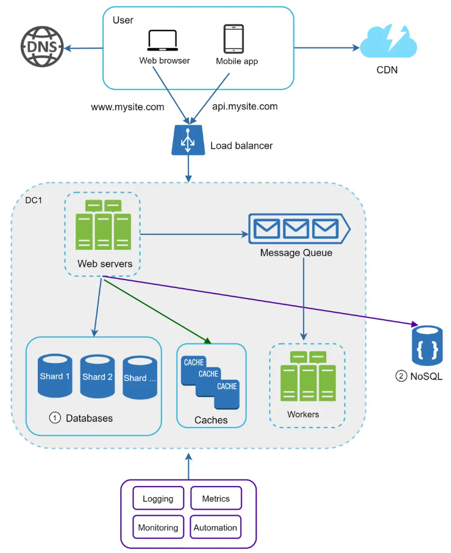
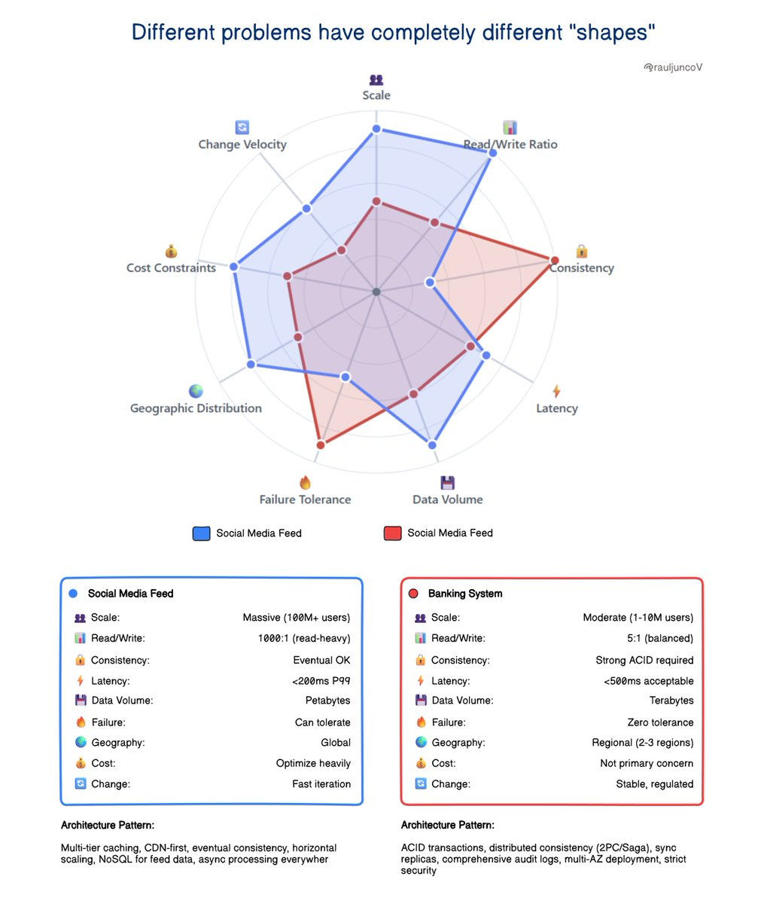

#+title: system design
* intro
- eg: news feed, Google search, chat system, etc
- big scope, vague instructions, system requirements, constraints and bottlenecks
- discord server - invite
** sample generic design

** scale from zero to millions of users
*** intro
- domain name server (dns) is a distributed database; returns public ip
- a single key can return multiple types of records (A, AAAA, MX, TXT) based on the query type and the requester's geographical location (Anycast)
- flow: web browser or mobile app --> dns lookup --> get ip --> ping ip with http request --> html page or json response 
- web browser -> html & javascript client side; server side languages handle business logic and storage
- mobile app -> json; api response 
- web server and database server are seperate to scale them independently
*** summary
- keep web tier stateless
- build redundancy at every tier
- cache data as much as you can
- support multiple data centers
- host static assets in cdn
- scale your data tier by sharding
- split tiers into individual services
- monitor your system and use automation tools
*** database
- relational (rows and columns); joins; queries
- non relational (key-value stores, graph stores, column stores, document stores)
- vertical scaling - more cpu, ram, etc
- horizontal scaling - sharding (more servers)
- celebrity problem
- join and de-normalize - single table queries 
*** load balancer
- redundancy
- private ips are used
- database replication - master (writes, updates and deletions), backups and slaves (reads)
- performance, reliablity, availablity 
*** cache tier
- the cache tier is a temporary data store layer, much faster than the database. the benefits of having a separate cache tier include better system performance, ability to reduce database workloads, and the ability to scale the cache tier independently
- use case: more reads than writes
- cons: volatile memory; persistent data stores to be created for important data
- best practice: expiration policies (time to live - ttl), consistency, mitigate failures with multiple cache servers (avoid single point of failure), eviction policies (least recently used - lru, least frequently used - lfu, first in first out - fifo), fall back to origin source  
- recommended read: scaling memcache at facebook 
*** content delivery netwrok (cdn)
- static content like images, videos, css, javascript files, etc.
- dynamic content caching - based on request path, query strings, cookies, and request headers
*** stateless web tier
- state is fetched from database server; application layer remains stateless
- in this stateless architecture, http requests from users can be sent to any web servers, which fetch state data from a shared data store. state data is stored in a shared data store and kept out of web servers. a stateless system is simpler, more robust, and scalable.
*** data centers
- traffic redirection (geodns) 
- data synchronization
- test and deployment
*** message queue
- durable component - apache kafka (ai / analytics), rabbitmq (complex routing / web), apache pulsar (geo replication), nats (jetstream / iot edge), valkey (redis - simple and fast) 
- asynchronous communication
- producer (publishes) -> message queue -> consumer (subscribes and consumes)
- variables: persistency, throughput vs latency, delivery guarentees, operational overheads 
*** logging, metrics, monitoring and automation
**** metrics
- host level metrics: cpu, memory, disk i/o, etc.
- aggregated level metrics: for example, the performance of the entire database tier, cache tier, etc.
- key business metrics: daily active users, retention, revenue, etc.
**** software
- prometheus, grafana, 
** back of the envelope estimation
- estimate system capacity or performance requirements: power of two, latency and availablity numbers
- latency numbers
|------------------------------------+-----------+-----------------------+------------|
| Operation                          | Time (ns) | Time (Human Readable) | Category   |
|------------------------------------+-----------+-----------------------+------------|
| L1 cache reference                 |       0.5 | 0.5 ns                | CPU        |
| Branch mispredict                  |         5 | 5 ns                  | CPU        |
| L2 cache reference                 |         7 | 7 ns                  | CPU        |
| Mutex lock/unlock                  |       100 | 100 ns                | Memory/OS  |
| Main memory reference              |       100 | 100 ns                | Memory     |
| Compress 1K bytes (Zippy)          |     10000 | 10 us                 | CPU/Memory |
| Send 2K bytes over 1 Gbps network  |     20000 | 20 us                 | Network    |
| Read 1 MB sequentially from memory |    250000 | 250 us                | Memory     |
| Round trip (same datacenter)       |    500000 | 500 us                | Network    |
| Disk seek                          |  10000000 | 10 ms                 | Disk       |
| Read 1 MB sequentially from net    |  10000000 | 10 ms                 | Network    |
| Read 1 MB sequentially from disk   |  30000000 | 30 ms                 | Disk       |
| Round trip (CA -> NL -> CA)        | 150000000 | 150 ms                | Network    |
|------------------------------------+-----------+-----------------------+------------|
*** notes
- ns = nanosecond, µs = microsecond, ms = millisecond
- 1 ns = 10^-9 seconds
- 1 µs= 10^-6 seconds = 1,000 ns
- 1 ms = 10^-3 seconds = 1,000 µs = 1,000,000 ns
*** visual representation
[[file:./x_latency_google_engineer.svg]]
** general research   
*** security in stateless architecture
- identity & authentication: how the requester proves who they are
- authorization (claims): what the requester is allowed to do, embedded within the token
- integrity: ensuring the request hasn't been altered in transit
- token lifecycle: managing issuance, expiration, and revocation
- transport security: protecting the data in motion
**** steps
- secure token managment: json web tokens(jwt), cryptographic signing (rs256 assymetric), double token strategy (access tokens, refresh tokens), no personally identifiable information (base64 encoded, not encrypted)
- defense in depth of gateway: api gateway validation (edge), content security policy, cross origin resource sharing (cors) to prevent cross site scripting (xss), rate limiting
- revocation paradox - denylist, stateless by default and stateful by exception
- transport layer - tls 1.3 prevents man in the middle (mitm) attacks
- storage - httponly cookies - prevents js from accessing token (anti-xss)
- validation - exp (temporal / when) and aud (domain / where) - token validity
- logic - claims based access control - decouple user's identity from their specific permissions 
