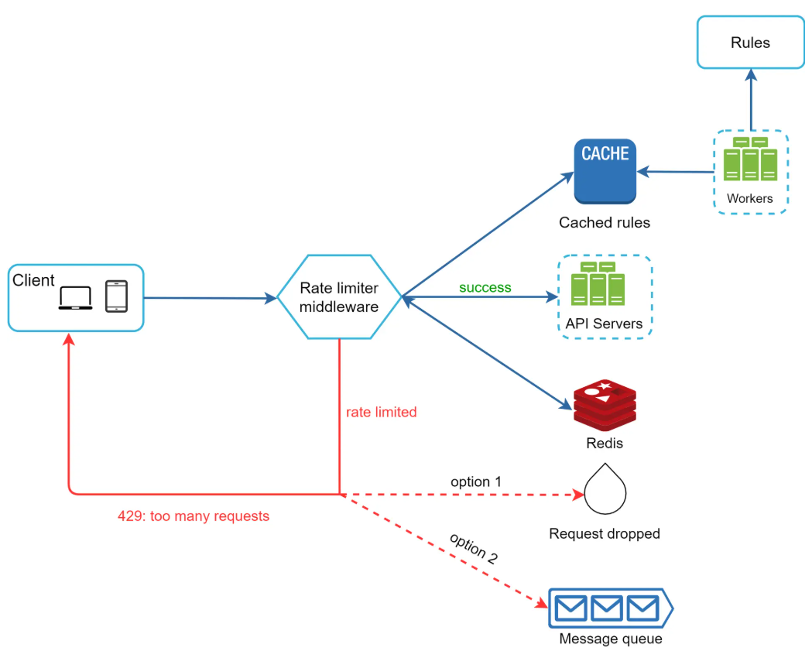

#+title: system design framework and examples
* framework
** new project - understand the problem and establish scope
- new project: problem statement, arch diag, database schema, api examples, tradeoffs, known limitations, improvements in next version
- feature list: list top 10 (urgent / important matrix) 
- users: bucket them - geo, vertical, product / module, form factor (hardware), compatiblity (os, browser) r&r 
- clusters: demography, connections, file formats (video, image, text, system of record), transaction (oltp / etl) vs analytical (olap / elt) 
- scale expectations: bucket wise info should be gathered (-60m, -36m, -12m, -6m, -3m, 0, 3m, 6m, 12m, 36m, 60m) 
- tech stack: previous, now and future 
- microservices (/ workers / features) - completed, wip, yet to start 
** existing project - general best practices
- cache reads
- tune database (Run EXPLAIN. Add indexes. Fix your N+1s)
- move work off hotpath (queue, dead letter queue)
- serve static assets from cdn (cache rules to avoid stale content)
- delete dead code (deps, bloats, middleware)  
- load test (simulate realistic patterns)
- scale (cpu, memory, storage)
- connection pooling (pgbouncer)
- observablity, rate limit, graceful degradation 
** step #2 - propose high level design and get buy-in
- block diagram, back of the envelope calculations, 
** step #3 - design deep dive
- priorities, system perf charc, bottlenecks and resource limitations
** step #4 - wrap up
- immprovements for next stage
- error cases (server failure, network loss,), operational issues
- do's and dont's 

* examples
|-------------------------------+------+--------------------|
| topic                         | info | comments           |
|-------------------------------+------+--------------------|
| rate limiter                  |      |                    |
| consistent hashing            |      |                    |
| key value store               |      |                    |
| unique id gen                 |      | distributed sytems |
| url shortner                  |      |                    |
| web crawler                   |      |                    |
| notification                  |      |                    |
| news feed                     |      |                    |
| chat                          |      |                    |
| search autocomplete           |      |                    |
| youtube                       |      |                    |
| google drive                  |      |                    |
| proximity service             |      |                    |
| nearby friends                |      |                    |
| google maps                   |      |                    |
| distributed message queue     |      |                    |
| metrics monitoring and alerts |      |                    |
| ad click event aggregation    |      |                    |
| hotel reservation             |      |                    |
| distributed email service     |      |                    |
| s3 like object storage        |      |                    |
| real time gaming leaderboard  |      |                    |
| payment                       |      |                    |
| digital wallet                |      |                    |
| stock exchange                |      |                    |
|-------------------------------+------+--------------------|
** rate limit design - x (?state) per y (property) per z (time period)
- examples: requests per user per second, accounts per ip per day, rewards per device per week

- benefits: prevent resource starvation (denial of service / dos), reduce costs, avoids server overload (bots vs actual user)
- scope: client side vs server side, based on ip / user / device / ?property, scale, distributed environment, seperate service or integrated in application code, intimation to users (error codes)  
- requirements: x requests per y per z, low latency, low memory footprint, distributed rate limiting, exception handling, fault tolerance (cache server going down)
- best scenario: middleware based API gateway is a fully managed service in cloud supports rate limiting, SSL termination, authentication, IP whitelisting, servicing static content, etc
- algorithms:
  + token bucket (throttler, parameters: bucket size and token refill rate, traffic shape: burst)
  + leaking bucket (fifo, parameters: bucket size and outflow rate, traffic shape: smooth) 
  + fixed window counter 
  + sliding window log (rolling window) 
  + sliding window counter (hybrid) 
- distributed environment: race condition and synchronization 
- performance optimization: multi data center setup, eventual consistency 
- monitoring: effectivess of algorithms and rules 
- others: hard vs soft limits, limiting can happen in any layer (osi), client cache, graceful exception handling, sufficient back off time 
- reference repo: https://github.com/envoyproxy/ratelimit
** consistent hashing

<eof>
