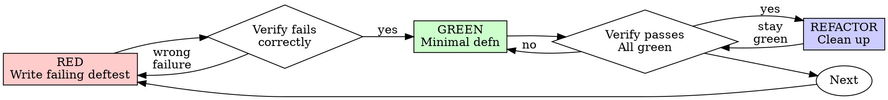

# Test-Driven Development (TDD) — Clojure Patch

## Overview

Write the test first. Watch it fail. Write minimal code to pass. **Clojure + lean-machine adapted.** See original generic TDD at `~/.agents/skills/test-driven-development/` (now patched here). Pure Markdown, 0 deps. Location: `~/.agents/skills/test-driven-development/` (global, `~/.agents/skills/` is cross-harness).

**Core principle:** If you didn't watch the test fail, you don't know if it tests the right thing.

**Violating the letter of the rules is violating the spirit of the rules.**

## When to Use

**Always:**
- New features
- Bug fixes
- Refactoring
- Behavior changes

**Exceptions (ask your human partner):**
- Throwaway prototypes (Quil sketch, `bb` one-liner) — delete after
- Generated code
- Configuration files (`deps.edn` itself)

Thinking "skip TDD just this once"? Stop. That's rationalization.

## The Iron Law

```
NO PRODUCTION CODE WITHOUT A FAILING TEST FIRST
```

Write code before the test? Delete it. Start over.

**No exceptions:**
- Don't keep it as "reference"
- Don't "adapt" it while writing tests
- Don't look at it
- Delete means delete

Implement fresh from tests. Period.

## Red-Green-Refactor — Clojure Loop



### RED - Write Failing Test

Write one minimal `deftest` showing what should happen at a **public `ns` seam**.

<Good>
```clojure
(ns app.orders-test
  (:require [clojure.test :refer [deftest is testing]]
            [app.orders :as orders]))

(deftest create-order-rejects-empty-email
  (testing "empty email is rejected with :email-required"
    (let [result (orders/validate {:email "" :total 10})]
      (is (= :email-required (:error result)))
      (is (nil? (:order result))))))
```
Clear name, tests real behaviour through public `defn`, one thing, no mocks
</Good>

<Bad>
```clojure
(deftest create-order-works
  (let [db (mock-db)] ; mock is the subject, not the code
    (orders/create! db {:email "a@b.com"})
    (is (= 1 (count @db)))))
```
Vague name, tests mock not behaviour, reaches past seam (`@db` internals)
</Bad>

**Requirements:**
- One behaviour per `deftest`/`testing` block
- Clear name: `deftest` reads as specification
- Real code at public `ns` API — no `defn-` internals, `with-redefs` only if port/fake unavoidable
- Use `CONTEXT.md` vocabulary for `ns`/`defn` names

Also see `writing-good-tests.md` (patched for `clojure.test`: literal `want` via EDN, not computed via code under test).

### Verify RED - Watch It Fail

**MANDATORY. Never skip.**

Clojure runners — pick what repo uses (leanest first):

```bash
bb test -n app.orders-test          # fastest, low RAM (preferred on 6 Gi)
clojure -M:test -n app.orders-test # Clojure CLI
lein test app.orders-test
# or REPL (CIDER): C-c C-t, or (clojure.test/run-tests 'app.orders-test)
```

Confirm:
- Test fails (not errors)
- Failure message is expected (`:email-required` vs `nil`)
- Fails because feature missing (not typo / missing `require`)

**Test passes?** You're testing existing behaviour. Fix test to hit missing path.

**Test errors (Exception / `FileNotFound`)?** Fix `ns` require, re-run until it fails correctly.

### GREEN - Minimal Code

Write simplest `defn` to pass the `deftest`. No extra arities, no spec, no perf.

<Good>
```clojure
(ns app.orders)

(defn validate [{:keys [email]}]
  (if (clojure.string/blank? email)
    {:error :email-required}
    {:order {:email email}}))
```
Just enough to pass
</Good>

<Bad>
```clojure
(defn validate
  ([m] (validate m {}))
  ([m {:keys [strict? max-retries backoff]}] ; YAGNI: no deftest needs these
   ;; ...
   ))
```
Over-engineered, speculative generality
</Bad>

Don't add features, refactor other `ns`, or "improve" beyond the `deftest`. Keep `deps.edn` minimal — `neil add` only after user approves.

### Verify GREEN - Watch It Pass

**MANDATORY.**

```bash
bb test -n app.orders-test
# or clojure -M:test -n app.orders-test
```

Confirm:
- That `deftest` passes
- Other `deftest`s still pass (`bb test` full suite later, but at least the `ns`)
- `clj-kondo --lint src` shows no new warnings

**Fails?** Fix `defn`, not `deftest`.

**Other `ns` fails?** Fix now — lean machine: run affected `ns` first, full suite at end.

### REFACTOR - Clean Up

After green only:
- Remove duplication (extract pure `defn`)
- Improve `defn`/`ns` names per `CONTEXT.md`
- Keep `->`/`->>` threading idiomatic, `ns` clean of unused requires

Keep `deftest`s green. Don't add behaviour. Run single-`ns` test after each step.

### Repeat

Next failing `deftest` for next tracer bullet.

## Good Tests — Clojure

| Quality | Good | Bad |
|---------|------|-----|
| **Minimal** | One thing. `and` in name? Split. | `(deftest validates-email-and-domain-and-whitespace)` |
| **Clear** | Name describes behaviour | `(deftest test1)` |
| **Shows intent** | Demonstrates desired `ns` API | Obscures what `defn` should do |
| **Data-oriented** | Tests data in → data out, pure | Tests `atom` internals or `defn-` |

When writing/changing any `deftest`, read `writing-good-tests.md` for rules that keep tests honest:
- Name the production change that would make the `deftest` fail — before writing it
- Assert on real behaviour at `ns` seam, never on mock/`with-redefs` existence
- Keep test-only helpers in `test/` utils, out of `src/` `ns`
- Understand a dependency's side effects (DB, HTTP) before faking it at port boundary

## Common Rationalizations

| Excuse | Reality |
|--------|---------|
| "Too simple to test" | Simple `defn` breaks. `deftest` takes 30 seconds. |
| "I'll test after" | Tests written after pass immediately — which proves nothing. You never watched it fail, so you never proved it can catch bug. Test-first forces that failure. |
| "Tests after achieve same goals" | Tests-after answer "what does this do?"; tests-first answer "what should this do?" Tests written after are biased by code you already wrote. |
| "Already manually tested in REPL" | REPL is ad-hoc: no record, no re-run when code changes, easy to forget cases. `deftest` runs same way every time. REPL complements `deftest`, not replaces. |
| "Deleting X hours is wasteful" | Sunk cost — time already spent. Real choice: rewrite with TDD (high confidence) vs keep untrusted code. Keep is waste. |
| "Keep as reference, write deftest first" | You'll adapt it. That's testing after. Delete means delete. |
| "Need to explore first" | Fine. Throw away exploration `ns`, start with TDD. `comment` blocks don't count as `deftest`. |
| "Test hard = design unclear" | Listen to `deftest`. Hard to test = hard to use at seam. Deepen module per `codebase-design`. |
| "TDD will slow me down" | TDD *is* pragmatic: catches bugs before commit, prevents regressions, lets you refactor without fear on this lean box. |
| "Existing `ns` has no tests" | You're improving it. Add `deftest` for existing `defn`s first. |

## Red Flags - STOP and Start Over

- Code before `deftest`
- `deftest` after `defn`
- `deftest` passes immediately
- Can't explain why `deftest` failed
- Tests added "later"
- "I already REPL-tested it"
- "Tests after achieve same purpose"
- "Keep as reference" or "adapt existing code"
- "TDD is dogmatic, I'm being pragmatic"

**All mean: Delete code. Start over with TDD at `ns` seam.**

## Example: Bug Fix — Clojure

**Bug:** Empty email accepted

**RED**
```clojure
(deftest rejects-empty-email
  (is (= {:error :email-required}
         (orders/validate {:email ""}))))
```

**Verify RED**
```bash
$ bb test -n app.orders-test
FAIL in (rejects-empty-email) — expected {:error :email-required}, got {:order {:email ""}}
```

**GREEN**
```clojure
(defn validate [{:keys [email]}]
  (if (str/blank? email)
    {:error :email-required}
    {:order {:email email}}))
```

**Verify GREEN**
```bash
$ bb test -n app.orders-test
PASS — 1 tests, 1 assertions
$ clj-kondo --lint src  # no new warnings
```

**REFACTOR**
Extract `blank-email?` helper if multiple `ns` need it.

## Verification Checklist

Before marking work complete:

- [ ] Every new public `defn` has a `deftest` at its `ns` seam
- [ ] Watched each `deftest` fail before implementing (RED)
- [ ] Each `deftest` failed for expected reason (feature missing, not typo)
- [ ] Wrote minimal `defn` to pass each `deftest` (GREEN)
- [ ] All `deftest`s pass (`bb test` or `clojure -M:test`)
- [ ] `clj-kondo --lint src` clean, no new warnings
- [ ] `deftest`s use real `ns` API ( `with-redefs` only for unavoidable port/DB fake)
- [ ] Edge cases and error paths covered as `testing` blocks

Can't check all boxes? You skipped TDD. Start over.

## When Stuck

| Problem | Solution |
|---------|----------|
| Don't know how to test | Write wished-for `defn` API in `test/`, write `is` assertion first. Ask human via `grilling`. |
| `deftest` too complicated | Design too shallow/complex. Simplify `ns` interface, deepen module per `codebase-design`. |
| Must `with-redefs` everything | Code too coupled. Inject dependency as arg/protocol, test pure core via data. |
| Setup huge (DB, fixtures) | Extract `test` helpers. Still complex? Simplify `ns` design; use `SQLite` in-memory fake for local. |

## Debugging Integration

Bug found? Write failing `deftest` reproducing it first (or `bb` harness if no seam). Follow TDD cycle. `deftest` proves fix and prevents regression. Never fix bugs without a `deftest`. Pair with `diagnosing-bugs` for tight loop.

## Final Rule

```
Production defn → deftest exists and failed first at ns seam
Otherwise → not TDD
```

No exceptions without human partner's permission. Prefer `bb test` for speed on this 6 Gi box; run full `clojure -M:test` once at ticket end.

## Lean Notes

- Use `bb` for tight loop; cold JVM `clojure -M:test` is heavy — warm REPL > cold.
- Keep `deps.edn` minimal; `neil add` only after approval.
- REPL (CIDER) complements `deftest` but does not replace it. Structure code for `C-c C-e` eval *and* `deftest` coverage.
